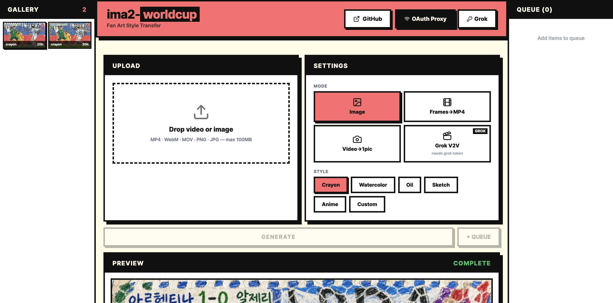

# ima2-worldcup

AI fan art style transfer for sports highlights — turn World Cup clips into copyright-safe crayon, watercolor, oil, sketch, or anime artwork.



## Modes

| Mode | Input | Output | Engine |
|------|-------|--------|--------|
| **Image** | Single image | Styled image | GPT 5.4 mini |
| **Frames→MP4** | Video file | Styled MP4 | GPT 5.4 mini + ffmpeg.wasm |
| **Video→1pic** | Video file | Single styled keyframe | GPT 5.4 mini + ffmpeg.wasm |
| **Grok V2V** | Video file | Styled video | xAI Grok |

## Requirements

- **Node.js ≥ 20**
- A modern browser with **SharedArrayBuffer** support (Chrome, Edge, Firefox, Safari). The
  app sends `COOP`/`COEP` headers so ffmpeg.wasm can run frame extraction and MP4/GIF
  assembly entirely client-side.
- An auth source for image generation, either:
  - **Codex OAuth** via the local `openai-oauth` proxy on `:10531` (started automatically by
    `npm run dev` / `ima2w serve`), or
  - a **direct OpenAI API key** entered through the in-app **Connect** button (used on Vercel
    or anywhere the local proxy isn't running).
- **Grok V2V** mode additionally needs an xAI Grok token (entered via Connect).

## Quick Start

### Local Development

```bash
git clone https://github.com/lidge-jun/ima2-worldcup.git
cd ima2-worldcup
npm install
npm run dev
# → Next.js on http://localhost:3477
# → openai-oauth proxy on http://127.0.0.1:10531
```

The dev script starts both the Next.js app and the openai-oauth proxy together.

### Install via npm

```bash
npm i -g ima2-worldcup
ima2w serve            # → http://localhost:3477 (browser auto-opens)
ima2w serve --port 4000
ima2w --version
```

`ima2w serve` runs the prebuilt standalone server. If `openai-oauth` is installed it also
launches the proxy; otherwise it runs in API-key-only mode (use the Connect button).

### Deploy to Vercel

```bash
vercel deploy
```

No code changes needed. The local proxy is local-only, so on Vercel users provide their
OpenAI API key via the Connect button.

## Usage

1. **Upload** an image or a video (drag-and-drop or click). The mode auto-selects to match
   the file type.
2. **Pick a mode** (Image / Frames→MP4 / Video→1pic / Grok V2V) and a **style** (or a custom
   prompt).
3. For **Frames→MP4**, set the frame rate; each extracted frame is restyled and the result is
   assembled into a downloadable MP4.
4. Click **Generate**. Watch progress in the Preview panel; queue multiple jobs from the side
   panel.
5. **Download** the result, or reopen any past result from the **Gallery** (persisted locally).

## Architecture

```
Browser                          Server (Next.js API Routes)
┌─────────────────────┐         ┌──────────────────────┐
│  Upload video/image  │         │  /api/generate       │
│  ffmpeg.wasm         │────────▶│  → openai-oauth proxy│
│  (frame extraction,  │         │    or direct API key │
│   MP4/GIF assembly)  │         │  → GPT 5.4 mini i2i │
│  Preview + Download  │         │                      │
└─────────────────────┘         └──────────────────────┘
```

- **Video processing runs entirely in the browser** via ffmpeg.wasm — no server cost.
  AI-styled frames are normalized to a uniform even canvas before H.264 encoding so the
  encoder never sees a mid-stream dimension change.
- **Image generation** proxied through Next.js API routes to OpenAI.
- **Auth**: Codex OAuth (local proxy) or direct API key (Vercel).

## Tech Stack

| Layer | Choice |
|-------|--------|
| Framework | Next.js 16 (App Router) |
| Styling | Tailwind CSS 4 |
| Design | Neobrutalism (red + black) |
| Video | ffmpeg.wasm (browser) |
| Image AI | GPT 5.4 mini (image_generation tool) |
| Video AI | xAI Grok V2V |
| Font | Pretendard + system |
| Icons | Lucide React |

## Styles

6 presets: **Crayon**, **Watercolor**, **Oil**, **Sketch**, **Anime**, **Custom** (free-form prompt)

## Development

- `npm run dev` — app + proxy with hot reload.
- `npm run build` — production build (Next.js standalone output).
- `/qa` — a dev-only in-browser regression harness for the ffmpeg pipeline (varying-dimension
  MP4/GIF assembly, frame/keyframe extraction). Available under `npm run dev`; returns 404 in
  production builds.

## License

MIT © lidge-jun
